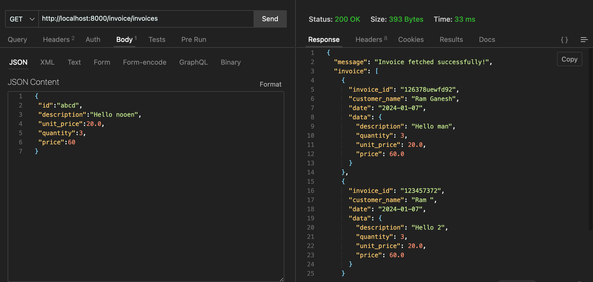
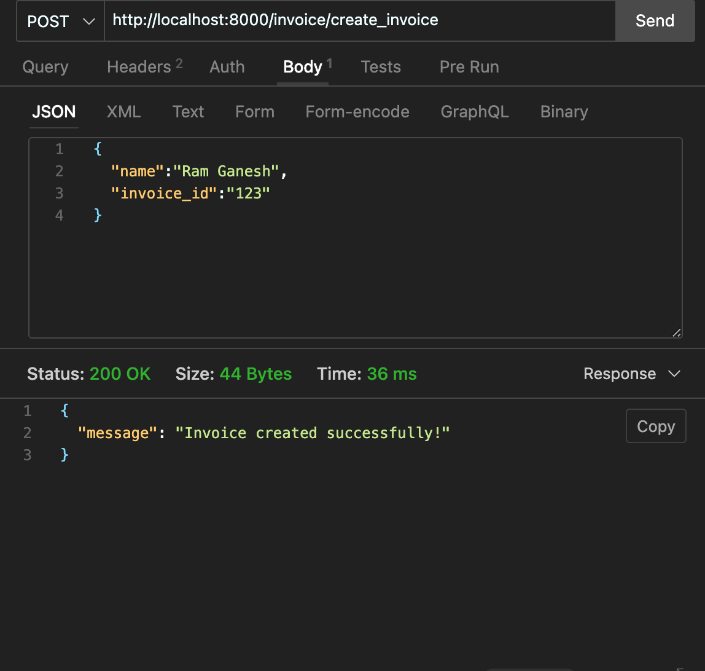
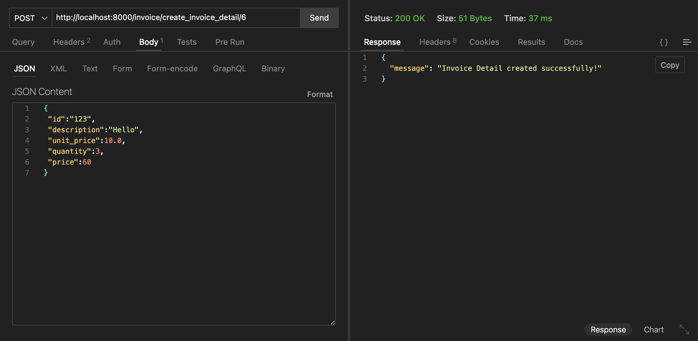
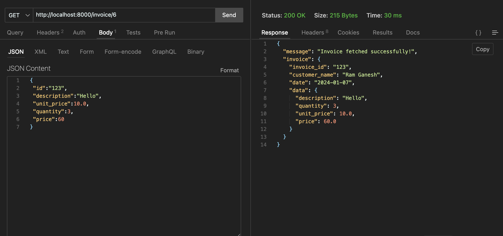
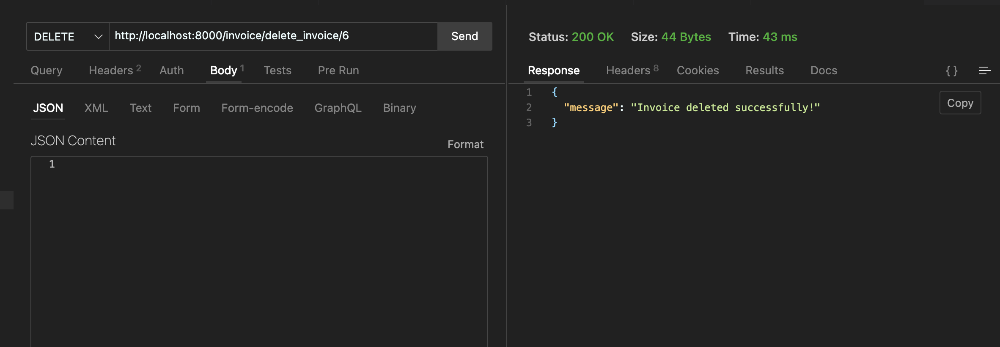

# Invoices

Django application for managing invoices.

## Route description
- /invoice/invoices - returns a list of invoices created so far (GET)
- /invoice/create_invoice - creates a new invoice (POST)
- /invoice/create_invoice_detail/<int:pk> - create or updates the invoice with the given id (POST)
- /invoice/<int:pk> - returns details of the invoice with the given id (GET)
- /invoice/delete_invoice/<int:pk> - deletes the invoice with the given id (DELETE)

## Installation

- Clone the repository
- Copy the .env.example file to .env
  ```sh
   cp .env.example .env
  ```
- Setup the virtualenv
  - Create a virtualenv for this project.
    ```sh
     pipenv install
    ```
  - Activate virtualenv for this project.
    ```sh
     pipenv shell
    ```
  - Install dev dependencies
    ```sh
     pipenv install --dev
    ```
- Change directory to the project root
  ```sh
   cd invoice_crud
  ```
- To run migrations
  ```sh
   python manage.py migrate
  ```
- To run the server
  ```sh
   python manage.py runserver
  ```

## Images




